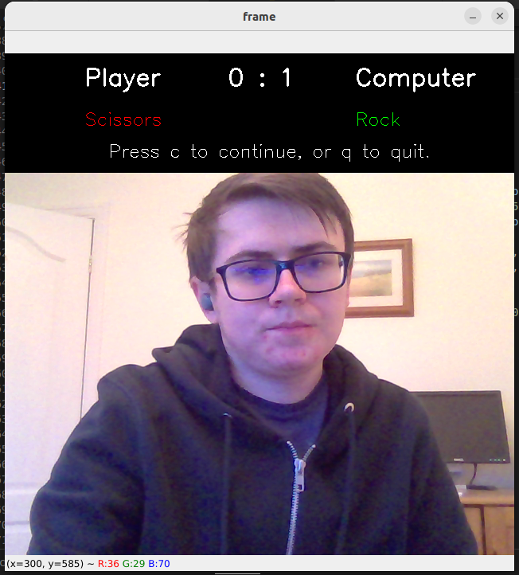
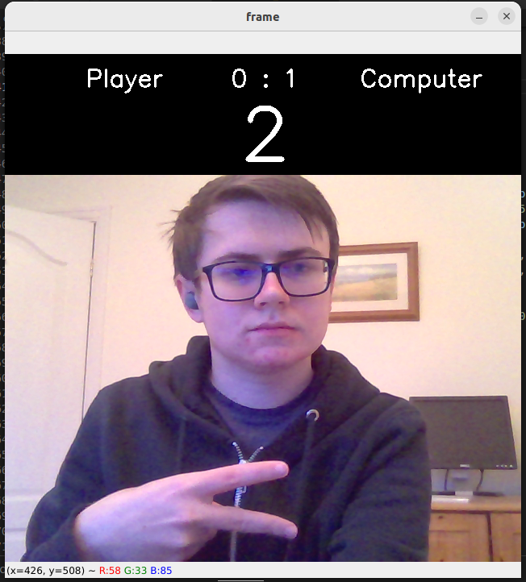

# Rock Paper Scissors Computer Vision Project

The aim of this project is to create a program to allow me to play rock paper scissors against the computer, using my webcam.

## Milestone 2
I created the computer vision model to detect whether I am signing rock, paper, scissors or nothing using the webcam.
This was made using Teachable Machine an online tool for creating machine learning models. I then downloaded the model into a .h5 file to be used by my program.

## Milestone 3
I set up the python 3.8 environment needed for tensorflow using conda, with the command:
```
conda create -n my_env python=3.8
```
Then installed the necessary libraries to the environment, and saved them to the requirements.txt file.
These libraries were opencv-python, tensorflow and ipykernel and they were set up using:

```
pip install <library>
```

# Milestone 4
Then I created the manual_rps.py file to manually play a game of rock paper scissors with the computer. This is a fairly basic program achieved using by defining various simple functions. The user choice was achieved by asking the user for an input, and the computer choice was a random option using random.choice from the random library.

```python
import random
import sys


def get_computer_choice():
    computer_choice = random.choice(range(0,3))
    return computer_choice

def get_user_choice():

    choices = ['rock','paper','scissors']

    while True:
        user_choice = input("\nRock Paper Scissors:")

        if isinstance(user_choice,str) == True and user_choice.lower() in choices:
            return choices.index(user_choice.lower())
        
        elif user_choice == 'quit':
            sys.exit()
        
        else:
            print("\n Please input rock paper or scissors.")

def get_winner(computer_choice,user_choice):
    res = (user_choice - computer_choice)%3
    if res == 1:
        print('You won!')
    elif res == 0:
        print('It is a tie')
    elif res == 2:
        print('You lost')

            
def play():
    computer_choice = get_computer_choice()
    user_choice = get_user_choice()
    get_winner(computer_choice,user_choice)

play()
```

# Milestone 5

Now I had to combine the game with my machine learning model.

I used the cv2 library to get a webcam capture and read specific frames, and in order to implement the computer vision model into my code I used the tensorflow library, specifically:
```python
from keras.models import load_model
```
Then, after taking the frame and normalising it, the model from milestone 2 could be loaded and used to give a prediction for the frame to get the user input.

```python
model = load_model('keras_model.h5',compile = False)
cap = cv2.VideoCapture(0)

data = np.ndarray(shape=(1, 224, 224, 3), dtype=np.float32)
ret, frame = cap.read()

resized_frame = cv2.resize(frame, (224, 224), interpolation = cv2.INTER_AREA)
image_np = np.array(resized_frame)
normalized_image = (image_np.astype(np.float32) / 127.0) - 1 
data[0] = normalized_image
data_tf = convert(data,np.float32)
prediction = model.predict(data_tf)

self.user_choice = prediction.argmax()
```

This allowed me to get the user input from the webcam, which could then be inserted into me previous manual code from before instead of taking an input in the command line. 

Next I restructured my code into a python class, making the  code easier to read.

Finally I wanted to make the game show the webcam the entire time, and add the score and results to the image. This was also done using opencv, with:
```python
cv2.copyMakeBorder()
```
and
```python
cv2.putText()
```
which allowed my to place a black border at the top of the screen and show the score and previous choices within it, as well as the countdown to the user input.

```python
while True:
        
    ret, frame = cap.read()

    frame_border = cv2.copyMakeBorder(src =frame,top = 150,bottom = 0,left = 0,right = 0,borderType = cv2.BORDER_CONSTANT)
    cv2.putText(frame_border,'Player',(100,40),font,1,(255,255,255),2,2)
    cv2.putText(frame_border,f'{self.user_score}',(280,40),font,1,(255,255,255),2,2)

    cv2.putText(frame_border,f': {self.computer_score}',(318,40),font,1,(255,255,255),2,2)
    cv2.putText(frame_border,'Computer',(440,40),font,1,(255,255,255),2,2)

    if self.prev_winner != 2:
        cv2.putText(frame_border,f'{choices[self.user_choice]}',(100,90),font,0.75,colours[self.prev_winner],1,2)
        cv2.putText(frame_border,f'{choices[self.computer_choice]}',(440,90),font,0.75,colours[-self.prev_winner],1,2)
    else:
        cv2.putText(frame_border,"You didn't show anything!",(180,90),font,0.75,(255,255,255),2,2)
    #cv2.putText(frame_border,answers[self.prev_winner],answers_pos[self.prev_winner],font,0.75,(255,255,255),2,2)
    
    cv2.putText(frame_border,"Press c to continue, or q to quit.",(130,130),font,0.75,(255,255,255),1,2)

    cv2.imshow('frame', frame_border)

    k = cv2.waitKey(1) & 0xFF

    if k == ord('c'):
        break
    
    elif k == ord('q'):
        cap.release()
        cv2.destroyAllWindows()
        sys.exit()
```



